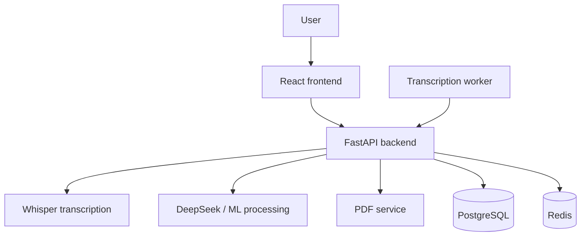

# Project Documentation

This document is the main product and technical overview for MindeSync.

## What MindeSync is

MindeSync is a lecture-processing platform. Users upload audio or video, receive a Whisper transcription, clean the text, generate learning materials with DeepSeek, and export the result into document formats.

## Main user flows

### Lecture transcription

1. A user uploads a file in the frontend.
2. The backend sends the task to Whisper.
3. The transcript is returned to the editor.

### AI text processing

1. A user selects a mode such as summary, terms, questions, or cheat sheet.
2. The frontend sends the text to the backend ML endpoint.
3. The backend calls DeepSeek through the configured provider.
4. The generated Markdown is returned to the frontend.

### Export

The final material can be exported to PDF, DOCX, TXT, or Markdown.

## System architecture



### Main services

- `src/` - React application
- `api/` - FastAPI backend and routers
- `ml/` - prompts and processing helpers
- `worker/` - separate transcription worker with tray UI
- `pdf-service/` - Node service that renders PDF documents
- `nginx/` - reverse proxy configuration for Docker

## Launch modes

### Local development

Recommended when you want to inspect the app and the worker locally.

- Use `setup.bat` / `setup.sh` to prepare the environment.
- Use `run.bat` / `run.sh` to start backend and frontend.
- Start the worker separately from `worker/`.

The worker guide is in [worker/WORKER_RUN.md](../worker/WORKER_RUN.md).

### Docker Compose

Recommended for a production-like stack.

```bash
docker compose up --build -d
```

This starts PostgreSQL, Redis, backend, frontend, Nginx, and PDF service.

The worker is not started by Docker Compose and should run on a workstation.

## Configuration

### Root `.env`

Copy `.env.example` to `.env` and configure the main runtime values:

- `DEEPSEEK_API_KEY`
- `DEEPSEEK_BASE_URL`
- `DEEPSEEK_MODEL`
- `POSTGRES_USER`
- `POSTGRES_PASSWORD`
- `POSTGRES_DB`
- `DATABASE_URL`
- `SECRET_KEY`
- `REDIS_URL`
- `CORS_ORIGINS`
- `REACT_APP_API_URL`

### Worker `config.json`

The worker has its own config:

- `SERVER_URL`
- `API_KEY`
- `WORKER_NAME`
- `WHISPER_MODEL`
- `DEVICE`
- `POLL_INTERVAL`

## Backend details

### Important routers

- `api/routers/auth.py` - login and user session logic
- `api/routers/users.py` - user accounts and profiles
- `api/routers/lectures.py` - lecture management
- `api/routers/boards.py` - shared boards
- `api/routers/catalog.py` - catalog and discipline tree
- `api/routers/export.py` - export endpoints
- `api/routers/admin.py` - admin dashboard APIs
- `api/routers/worker.py` - worker queue, download, heartbeat, result submission

### Worker API behaviour

- `POST /api/worker/register` validates the worker key
- `GET /api/worker/next` assigns the next pending task
- `GET /api/worker/download/{task_id}` returns the audio file
- `POST /api/worker/result/{task_id}` stores the transcription result
- `POST /api/worker/error/{task_id}` reports a worker error
- `POST /api/worker/heartbeat` updates the last heartbeat timestamp
- `GET /api/worker/status` returns queue counters and active worker names

The backend also runs a recovery loop that returns stale tasks to `pending` if the worker stops heartbeating.

## Worker behaviour

The worker is a small desktop process that polls the backend, downloads audio, runs Whisper locally, and submits the result.

Key behaviour:

- polls the server every `POLL_INTERVAL` seconds
- keeps a heartbeat while transcription is running
- stores the processed result back on the backend
- can be disabled or re-enabled from the tray icon

The full operational guide is in [worker/WORKER_RUN.md](../worker/WORKER_RUN.md).

## PDF service

`pdf-service/` is a separate Node.js service that renders Markdown to PDF through Playwright and Chromium.

- it listens on port `3001`
- the backend sends Markdown to it when PDF export is requested
- it supports KaTeX rendering for formulas

## Data storage

The project uses PostgreSQL for persistent data, including:

- users and roles
- lectures and audio files
- transcription tasks
- transcriptions and generated materials
- boards and catalog entities

Redis is used for token invalidation and WebSocket sync.

## GPU / CUDA

Whisper can run on CPU or GPU.

- CPU works everywhere but is slower
- NVIDIA GPU with CUDA significantly speeds up transcription
- worker setup supports installing PyTorch with `cu118`

GPU-specific setup is documented in [CUDA_SETUP.md](CUDA_SETUP.md).

## Common troubleshooting points

- if the worker does not appear active, check whether there are any `processing` tasks in the queue
- if the worker key is rejected, confirm that `WORKER_API_KEYS` on the server matches the worker key exactly
- if Whisper or Tkinter fails on Windows, check `TCL_LIBRARY` and `TK_LIBRARY`
- if PDF export fails, verify that the PDF service is running on port `3001`

## Related documentation

- [README.md](../README.md)
- [Features](FEATURES.md)
- [Technical Summary](TECHNICAL_SUMMARY.md)
- [Worker Guide](WORKER_GUIDE.md)
- [CUDA Setup](CUDA_SETUP.md)
- [Whisper Install](WHISPER_INSTALL.md)
